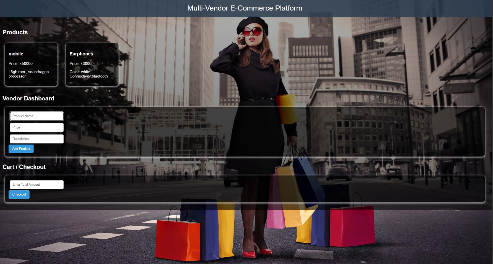

Multi-Vendor E-Commerce Platform

📌 Project Description

This project is a full-stack Multi-Vendor E-Commerce Platform developed using React, Node.js, Express, and MongoDB. The system allows multiple vendors to add and manage products, while customers can browse products, add items to cart, and place orders.

The platform demonstrates key concepts of full-stack development including API integration, database management, and modular architecture.

---

🚀 Features

- Product listing by vendors
- Vendor dashboard to add products
- Customer product browsing
- Cart and checkout system
- Order management
- MongoDB cloud database integration

---

🛠️ Technologies Used

- Frontend: React, Bootstrap
- Backend: Node.js, Express
- Database: MongoDB Atlas
- Tools: VS Code, GitHub

---

⚙️ Setup Instructions

1. Clone Repository

git clone https://github.com/your-username/your-repo-name.git
cd your-repo-name

2. Install Backend Dependencies

cd backend
npm install

3. Run Backend Server

node server.js

4. Install Frontend Dependencies

(Open new terminal)

npm install

5. Run Frontend

npm start

---

🌐 Application Running

- Frontend: http://localhost:3000
- Backend: http://localhost:5000

---

📸 Screenshots

---

📈 Learning Outcomes

- Understanding of full-stack application development
- API integration between frontend and backend
- Working with MongoDB cloud database
- Managing multiple modules (Customer, Vendor, Admin)

---

📌 Conclusion

This project provides a practical understanding of building scalable web applications with multiple user roles and real-time data handling.
